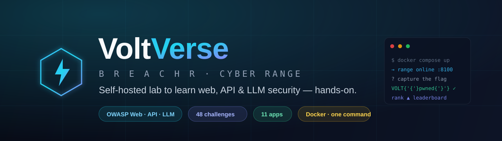
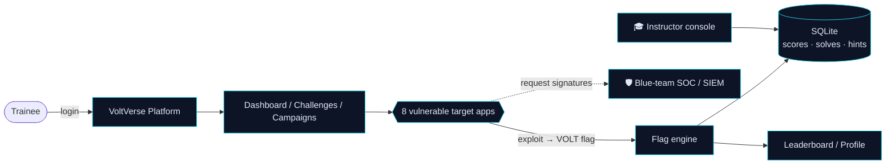

<div align="center">



<br/>

[](LICENSE)


**A self-hosted cyber range that looks like a real SaaS product — 8 realistic target apps, 42 hands-on challenges, and a full learning platform.**

[Quick start](#-quick-start) · [What's inside](#-whats-inside) · [Learning layer](#-learning-layer) · [Architecture](#-architecture) · [Difficulty](#-difficulty-levels)

</div>

---

> [!WARNING]
> **This application is intentionally vulnerable.** It exists to teach and practice web / API / LLM
> security. **Do not deploy it on the public internet or any network you don't fully control.** Run it locally.

VoltVerse (codename **BREACHR**) packs the **OWASP Web Top 10**, **API Top 10**, and **LLM Top 10** into
one polished, self-contained platform — with flags, scoring, a leaderboard, progressive hints,
difficulty-aware walkthroughs, cross-app attack campaigns, an instructor console, and an
auto-detecting blue-team SOC. One PHP + Apache + SQLite container. One command to run.

## 🚀 Quick start

```bash
git clone https://github.com/ghostbit11/voltverse-lab.git
cd voltverse-lab
docker compose up -d --build
```

Open **http://localhost:8100**, sign up, and start hacking.
The **first** account you register automatically becomes the **instructor**.

## 🎯 What's inside

| App | Focus | Example vulnerabilities |
|-----|-------|-------------------------|
| 🛒 **Voltmart** (store) | OWASP Web Top 10 | SQLi · stored/reflected XSS · command injection · LFI · IDOR · SSRF · SSTI · XXE · unrestricted upload · price/coupon logic |
| 🏦 **Aurora Bank** | Business logic & access control | BOLA/IDOR · card-data exposure · negative-amount transfer · transfer-from-any · OTP bypass · race condition |
| 🔐 **VoltID** (JWT SSO) | Auth / crypto | `alg:none` bypass · weak HMAC secret |
| 🤖 **Voltmart Copilot** | OWASP LLM Top 10 | system-prompt leak · direct/indirect injection · tool abuse · data disclosure · RAG poisoning |
| 📦 **VoltBook Microsite** | Client-side | reflected XSS · open redirect |
| 🌐 **VoltCorp Website** | Server-side | path traversal / LFI · CSRF |
| 🔌 **Voltmart REST API** | OWASP API Top 10 | BOLA · excessive data exposure · mass assignment · BFLA · broken auth |
| 🔗 **Campaigns** | Attack chains | multi-stage, cross-app kill chains |

## 🧠 Learning layer

- **🚩 Flag capture & scoring** — exploit a bug, submit its `VOLT{...}` flag, earn points & first-blood.
- **🏆 Leaderboard & profile** — ranks, skill breakdown, and a printable completion certificate.
- **💡 Hints & 📖 walkthroughs** — progressive hints (small point cost) and **difficulty-aware**
  step-by-step solutions. Both toggle per-cohort from the instructor console.
- **⛓️ Campaigns** — chain individual bugs across apps into realistic breach scenarios.
- **🎓 Instructor console** — cohort progress, per-challenge landing rate, content controls, account resets.
- **🛡️ Blue-team SOC** — attacks are auto-detected and surfaced on a live SIEM dashboard.

## 🏗 Architecture



Every app reads a per-session **difficulty** cookie and switches its own code path — from textbook-vulnerable
to a hardened reference implementation — so the same bug can be practised at four levels.

## 🎚 Difficulty levels

Inspired by bWAPP — every vulnerability scales:

| Level | Behaviour |
|-------|-----------|
| 🟢 **Low** | Textbook vulnerability, no defences. |
| 🟠 **Medium** | Naive filters (blacklists) that can be bypassed. |
| 🔴 **High** | Stronger but incomplete protection with a gap to find. |
| 🔵 **Secure** | Correct, fixed implementation — the remediation reference (not exploitable). |

## 🧩 Tech stack

**PHP 8.2** · **Apache** · **SQLite** · **Docker / docker-compose**. No external services, no API keys, no internet required at runtime.

## 📜 License

[MIT](LICENSE) — for **education and authorized security training only**. Keep it off the public internet (see the warning above).

<div align="center"><sub>Built for hands-on security learning · ⭐ star the repo if it helped you learn.</sub></div>
